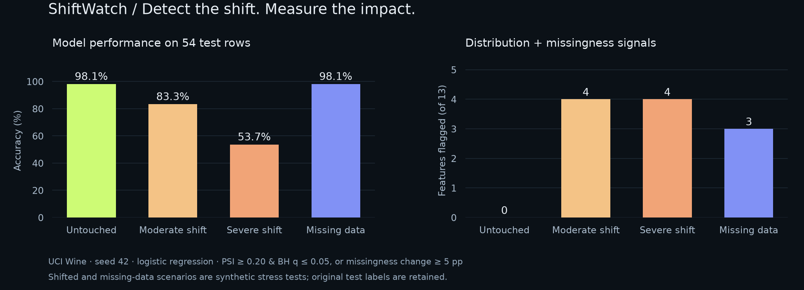
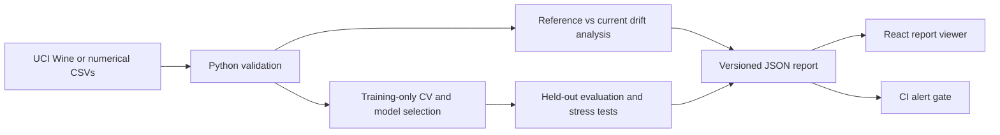

# ShiftWatch

**A reproducible ML monitoring workbench: detect changes in incoming data and measure their effect on a trained classifier.**

[](https://github.com/pralav-25/shiftwatch/actions/workflows/ci.yml)
[](pyproject.toml)
[](LICENSE)

[**Open the interactive dashboard →**](https://pralav-25.github.io/shiftwatch/) · [Methodology](docs/methodology.md) · [Model card](docs/model-card.md) · [Interview guide](docs/interview-guide.md)



A model's test score is only one part of its lifecycle. ShiftWatch asks what happens when new data no longer resembles the data used for training. It combines a reusable Python drift library, a command-line workflow, a real classification experiment, and an interactive TypeScript report viewer.

The bundled experiment uses **UCI Wine**. Shifted scenarios are explicitly synthetic; this is an educational monitoring workbench, with no claim of production deployment or business impact.

## What it does

- **Trains and selects models:** compares a dummy baseline, logistic regression, and a random forest with five-fold stratified cross-validation. Imputation and scaling are fitted inside each fold.
- **Evaluates a separate test set:** reports accuracy, macro F1, log loss, a confusion matrix, and bootstrap accuracy intervals.
- **Detects numerical data drift:** computes Population Stability Index, two-sample KS tests, Benjamini–Hochberg adjusted p-values, Wasserstein distance, and missingness changes.
- **Works with your data:** compares two numerical CSVs and exports a validated JSON report. An optional nonzero exit code supports CI data gates.
- **Explains the result:** the dashboard offers scenario switching, feature search, distribution inspection, exploratory thresholds, model comparisons, report import, and export.
- **Reproduces the evidence:** committed results, dataset fingerprints, split indices, fixed seeds, dependency locks, and automated tests make the experiment inspectable.

The dashboard reads files locally. It does not send uploaded reports to a server, run Python in the browser, or pretend to be a live production monitor.

## Run the experiment

Requires **Python 3.12**. The dataset ships with scikit-learn; no dataset download, cloud account, or API key is needed after installing dependencies.

```bash
git clone https://github.com/pralav-25/shiftwatch.git
cd shiftwatch
python3.12 -m venv .venv
source .venv/bin/activate       # Windows: .venv\Scripts\activate
pip install -r requirements.lock
pip install --no-deps -e .
shiftwatch demo
```

This writes `public/reports/demo.json`. Open the [dashboard](https://pralav-25.github.io/shiftwatch/) and select **Load report** to inspect it. For a lightweight library installation without plotting and test tools, use `pip install -e .` instead of the locked environment.

### Compare your own data

Use two CSVs containing the same named numerical feature columns. Column order can differ. Remove identifiers and target labels. Each file needs at least five rows; missing numeric values are allowed, infinity and nonnumeric columns are rejected.

```bash
shiftwatch compare examples/reference.csv examples/shifted.csv --output report.json

# A data-quality gate: exit 2 if any feature alerts; the report is still saved.
shiftwatch compare reference.csv current.csv \
  --psi-threshold 0.2 --alpha 0.05 --fail-on-alert --output report.json
```

Load the resulting JSON into the dashboard. Comparisons without a trained model show drift diagnostics without fabricated model-performance metrics. The dashboard accepts up to 200 features, 20 scenarios, and 5 MB per report; the Python library can analyze wider tables.

```python
import pandas as pd
from shiftwatch import compare_frames

result = compare_frames(
    pd.read_csv("examples/reference.csv"),
    pd.read_csv("examples/shifted.csv"),
    psi_threshold=0.2,
)
print(result["alert_count"])
```

## Results you can reproduce

Seed **42**; 124 training rows; 54 held-out test rows. Training CV selects **logistic regression**, with mean macro F1 of **0.9834** across five folds. These scores describe a small, relatively easy dataset; they are not evidence of general-purpose model quality.

| Scenario | Accuracy | Features flagged | Change applied |
|---|---:|---:|---|
| Untouched holdout | 98.1% | 0 / 13 | None |
| Moderate shift | 83.3% | 4 / 13 | +0.75 training standard deviations in four features |
| Severe shift | 53.7% | 4 / 13 | +2 training standard deviations in four features |
| Missing data | 98.1% | 3 / 13 | Approximately 30% missing in three features |

All perturbed scenarios reuse the same test rows and original labels. They are stress tests, not new independent real-world samples. Missingness triggers alerts even when this model's accuracy happens to remain unchanged—one reason to distinguish data quality from prediction quality.

See the [full JSON](public/reports/demo.json) for fold scores, confidence intervals, confusion matrices, feature statistics, exact split indices, and runtime versions.

## Run the dashboard locally

Requires **Node.js 22.18+** and **pnpm 11.19.0**.

```bash
corepack enable
pnpm install --frozen-lockfile
pnpm dev
```

Open the localhost URL printed by the development server. The dashboard uses React, TypeScript, Vinext, accessible Base UI/Shadcn primitives, and SVG charts. `pnpm build` generates a static dashboard in `dist/client`.

The Python pipeline and UI communicate through the versioned `shiftwatch/v1` JSON contract. This keeps the numerical analysis portable and the public demo inexpensive to host.



## Validation

```bash
pytest -q
ruff check src tests
ruff format --check src tests
pnpm test
pnpm typecheck
pnpm lint
pnpm build

# Reproduce and compare the checked-in numerical results:
shiftwatch demo --output /tmp/reproduced.json
python scripts/check_reproduction.py public/reports/demo.json /tmp/reproduced.json

# Regenerate the README figure:
python scripts/plot_results.py
```

The suite covers constant distributions, overflow bins, known multiple-testing corrections, missing/all-missing columns, invalid schemas, CLI exit behavior, report validation, filter logic, disjoint train/test splits, deterministic results, and a spy that verifies no preprocessor fits on held-out rows.

GitHub Actions runs Python tests, report reproduction, frontend tests, type checking, linting, and a production build. A separate workflow publishes the dashboard to GitHub Pages after checks pass. Browser interaction and visual regression tests are not included; optional WebMCP support is feature-detected and requires a compatible browser for runtime validation.

## Project map

```text
src/shiftwatch/       Python drift engine, experiment, and CLI
app/                 Interactive report dashboard
lib/report.ts        Report contract, validation, and alert/filter logic
tests/               Numerical, leakage, reproducibility, and CLI tests
tests-web/           Report-validation and dashboard-logic tests
examples/            Reference data and a documented synthetic shift
public/reports/      Reproducible experiment output
docs/                Methodology, model card, and interview preparation
scripts/             Reproduction checks and results figure
.github/workflows/   CI and static dashboard publishing
```

## Design decisions and limitations

This project favors inspectable statistics over an opaque “AI health score.” A distribution alert requires **PSI ≥ 0.20 and BH-adjusted KS p ≤ 0.05** by default. Missingness alerts use an absolute change of at least **5 percentage points**. PSI cutoffs are configurable heuristics, not universal statistical significance thresholds.

The monitor is univariate and numerical. It can miss changes in feature relationships and cannot establish concept drift without label-dependent analysis. Small samples, tied values, dependence between features, repeated monitoring, and exploratory threshold changes affect statistical interpretation. There is no automatic retraining, scheduled ingestion, model registry, or alert delivery service. [Read the methodology](docs/methodology.md) before adapting the rules to real operations.

## Data and license

Project code: [MIT](LICENSE). The bundled demo derives from **Wine**, by Stefan Aeberhard and M. Forina, UCI Machine Learning Repository, [DOI: 10.24432/C5PC7J](https://doi.org/10.24432/C5PC7J), licensed under [CC BY 4.0](https://creativecommons.org/licenses/by/4.0/). The experiment uses scikit-learn's copy, converts the class labels to zero-based indices, partitions the rows, and creates explicitly labeled synthetic perturbations. These transformations are not endorsed by the dataset authors.

Primary references: [UCI dataset](https://archive.ics.uci.edu/dataset/109/wine), [scikit-learn leakage guidance](https://scikit-learn.org/stable/common_pitfalls.html), [SciPy KS documentation](https://docs.scipy.org/doc/scipy/reference/generated/scipy.stats.ks_2samp.html).
